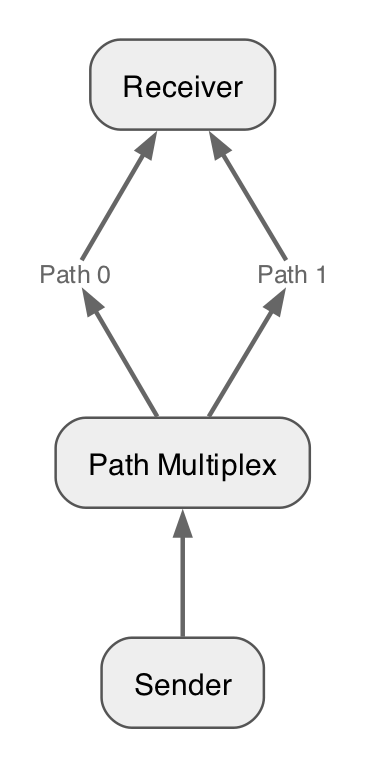
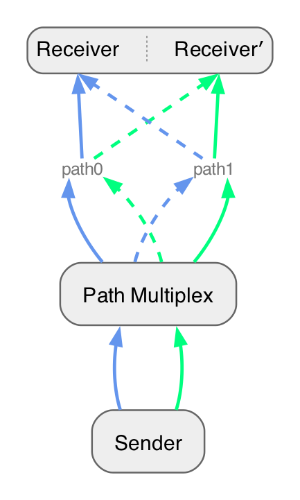
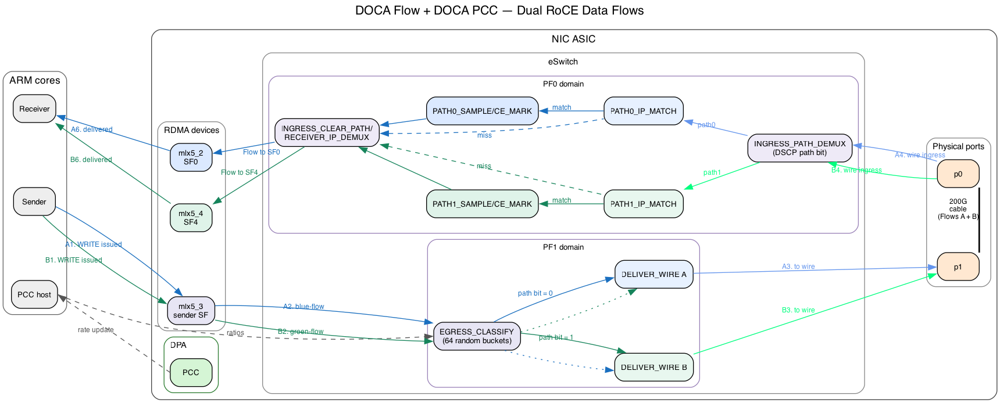

# Bonus section: Path Steering with PCC

# Summary

Earlier parts of the tutorial introduced two complementary BlueField programming models:

- **DOCA Flow** programs packet classification, modification, forwarding, and hardware counters in the NIC data plane.
- **DOCA PCC** runs a congestion-control algorithm on the DPA and reacts to RoCE transport events for individual queue pairs (QPs).

This bonus section combines them into a closed-loop, two-path steering system.
PCC continues to calculate a congestion-derived value for each QP, but it does not apply that value as a NIC rate limit.
Instead, the DPA reports it to the host, where it becomes an input to the DOCA Flow controller.
The controller converts the relative congestion signals into a packet-splitting ratio and updates an existing hardware dispatch table while traffic is running.

The experiment runs on one BlueField-3 using a physical port loopback.
Two virtual paths share the same cable and are distinguished by a temporary DSCP bit.
Two parallel RDMA QPs act as path-specific congestion probes.
The sender pipeline randomly assigns packets to paths; the receiver pipeline emulates a different ECN policy for each path, removes the private marker, and delivers the two QPs to separate receiver SFs.

By the end of this section, you will understand how to:

1. preserve path identity when standard RoCE CNP feedback identifies only a QP;
2. build a random HASH classifier whose distribution can be changed without recreating the HASH pipe;
3. connect per-QP PCC reports to live DOCA Flow entry updates; and
4. validate the complete data and feedback loop using hardware counters and host-side diagnostics.

The implementation supports DOCA 2.9, 3.1, and 3.4 through a shared compatibility layer.
DOCA 2.7 is not currently supported.
The logical pipeline and command-line model remain the same; only the SDK-specific host, PCC-reporting, and DOCA Flow APIs differ.

# Part A: Scenario

## A.1 Why a single QP is not enough

Start with the intuitive design: one sender, one receiver, and a path multiplexer that distributes packets from one RDMA queue pair (QP) over two paths.



The multiplexer can choose a path independently for every packet, but ordinary RoCE congestion feedback does not preserve that choice.
A receiver that sees an ECN-marked packet sends a Congestion Notification Packet (CNP) for the affected QP.
When the CNP reaches the sender, PCC can identify the QP, but it cannot tell whether the original data packet traversed path 0 or path 1.
Both paths have collapsed into one transport-level feedback stream.

This creates an observability problem.
Suppose path 0 is congested and path 1 is clear.
The sender may learn that the QP should slow down, but it has no path-specific signal from which to calculate a better packet-splitting ratio.
Changing the QP rate alone also reduces traffic on both paths, including the uncongested one.

The tutorial therefore separates two decisions:

1. PCC estimates congestion from transport feedback and exports a rate-like signal for each QP.
2. DOCA Flow uses those signals to change the fraction of packets assigned to each path.

PCC does not enforce the calculated rate in this example.
The DPA program returns `DOCA_PCC_DEV_MAX_RATE` to the NIC and reports its calculated value to the host as a steering signal.
DOCA Flow, rather than the normal PCC rate limiter, controls the traffic distribution.

## A.2 Paired QPs as path probes

To recover path identity, the application uses two parallel RDMA QPs with equal or comparable offered load.
We call them the blue QP and the green QP.



The colors identify QPs, not paths.
Packets from either QP may be assigned to either virtual path by the sender-side multiplexer.
At the receiver-side path emulator, however, each path marks only its designated probe QP:

| Selected virtual path | QP eligible for ECN marking | Interpretation |
| --- | --- | --- |
| Path 0 | Blue QP | Blue-QP congestion represents path 0 |
| Path 1 | Green QP | Green-QP congestion represents path 1 |

Packets from the other QP still traverse and consume capacity on that path; they are simply not used as that path's congestion probe.
Because only roughly half of a paired workload is eligible for marking on a given path, the receiver-side sampler uses twice the requested all-traffic marking probability, capped at 100%.
For example, an intended 5% path marking rate becomes a 10% sampling probability for the designated QP.

This compensation assumes the paired QPs contribute similar traffic volumes.
If one QP is idle or substantially slower, its PCC signal is no longer a representative probe for the corresponding path.
That is a property of this tutorial construction, not a general requirement of multipath steering.

The two QPs use different receiver destination IP addresses.
The destination IP identifies blue versus green traffic and lets the receiver deliver each flow to its receiver SF.
It does **not** encode the packet's selected path; that is a separate per-packet marker.

## A.3 Mapping the scenario onto one BlueField-3

The tutorial emulates two paths using the two PF domains and one physical loopback cable on a single BlueField-3:

- The sender application uses a sender SF in the PF1 domain.
- PF1 runs the egress steering pipeline and sends traffic through physical port `p1`.
- A loopback cable carries the traffic from `p1` to `p0`.
- PF0 runs the ingress path-emulation pipeline.
- Two receiver SFs represent the blue and green receiver endpoints.



Since both virtual paths share the same cable, the egress pipeline writes the selected path into IP ToS bit `0x04` (DSCP bit 0).
This bit is suitable for the experiment because the IPv4 DSCP/ECN byte is a RoCEv2 ICRC variant field.
The ingress pipeline reads the bit, applies the corresponding path policy, and clears only that private bit before delivering the packet.
Existing ECN bits and unrelated DSCP bits are preserved.

The UDP destination port is deliberately not used as a path marker.
UDP port 4791 is covered by the RoCEv2 invariant CRC; rewriting it causes the receiver to drop the packet even if a later rule restores the original value.

## A.4 Forward packet walk

For each outgoing RoCEv2 packet, the data plane performs the following steps:

1. The sender posts traffic on the blue or green RDMA QP through the sender SF.
2. PF1 admits RoCEv2 traffic to `EGRESS_CLASSIFY`.
   A 64-entry random HASH pipe selects a persistent bucket for the packet.
3. A metadata dispatch table maps that bucket to path 0 or path 1.
   Changing the number of buckets assigned to each path changes the steering ratio without rebuilding the HASH pipe.
4. The selected path-rewrite pipe writes DSCP path bit 0 or 1, and the packet is sent through the physical loopback.
5. PF0 reads the path bit first, then checks the destination IP.
   Only the probe QP designated for that path enters the path's probabilistic CE-marking stage.
6. PF0 clears the private path bit and uses the destination IP to deliver blue traffic to receiver SF0 and green traffic to receiver SF1.

Non-RoCE traffic bypasses the random classifier.

## A.5 Feedback and steering loop

Path selection is per packet, while congestion control and QP identification remain per transport flow.
The feedback and steering loop operates as follows:

1. PCC calculates a congestion-derived value for each sender QP on the DPA.
2. PCC reports these values to the host through binary trace reports on DOCA 3.x or a periodically polled PCC mailbox on DOCA 2.9.
3. The host averages reports over the interval and applies a persistent EWMA.
   Flows that have not yet been associated with a path are reported as `pending-map` and do not influence the ratio.
4. The controller compares the aggregate reduced-rate signals for the two path groups and converts the result into a number of path-0 buckets out of 64.
5. Only dispatch entries whose assignment crosses the old/new boundary are updated.
   No HASH entries are added or removed while traffic is running.

At startup, 32 buckets are assigned to each path.
The controller retains at least three buckets for a constrained path in the one-sided full-rate case, so both paths continue receiving probe traffic.
The 64-bucket representation gives a steering granularity of 1/64, or approximately 1.56%.

## A.6 What the experiment demonstrates

This experiment demonstrates how PCC and DOCA Flow can form a closed-loop traffic-steering system.
PCC measures congestion for the probe QPs, and the host converts those measurements into a desired path share.
DOCA Flow applies that share by updating the bucket dispatch entries while traffic continues, without rebuilding the random HASH pipe.
Together, PCC provides the feedback signal and DOCA Flow enforces the resulting per-packet steering decision at line rate.
The single-card loopback emulates the two paths for the tutorial, but the same control and steering design can target two real next hops.

# Part B: Run the completed solution

Before writing any DOCA Flow code, run the completed implementation and observe the behavior that your implementation must reproduce.
This gives you a known-good reference for the pipeline startup messages, initial path split, and hardware counters.

## B.1 Build the solution

From the repository root, configure the build and compile the PCC and steering applications:

```bash
meson setup build --reconfigure
ninja -C build
```

The same source builds on DOCA 2.9, 3.1, and 3.4 through the compatibility layer.

## B.2 Start the receiver-side path emulator

In the first terminal, start the ingress role on PF0 with the two receiver SF representors:

```bash
sudo ./build/doca_flow_steer \
  -r pci/0000:03:00.0,pf0sf0 \
  -R pci/0000:03:00.0,pf0sf4 \
  --path0-ip 10.0.0.1 \
  --path1-ip 10.0.0.11 \
  --role ingress \
  --path0-percent 0.025 \
  --path1-percent 0.05
```

This process reads the private path bit, applies the configured path-specific ECN policy, clears the private bit, and delivers each QP to its receiver SF.

## B.3 Start PCC with the completed egress solution

In a second terminal, start PCC on the sender and pass the PF1 sender SF representor to enable its embedded egress steering pipeline:

```bash
sudo ./build/doca_pcc \
  --device mlx5_1 \
  -r pci/0000:03:00.1,pf1sf0 \
  --path0-ip 10.0.0.1 \
  --path1-ip 10.0.0.11
```

On DOCA 3.x, successful setup includes these messages:

```text
EGRESS_BUCKET_DISPATCH ready: meta.u32[4] bucket -> changeable path forward
Classify random-bucket pipe ready: HASH/random writes bucket to meta.u32[4]
```

On DOCA 2.9, the classifier message is instead:

```text
Legacy random HASH ready: 6 bits, 64 immutable metadata buckets
```

The dispatch-ready message appears before the classifier-ready message on all supported versions.

## B.4 Generate traffic and observe the result

Start an `ib_write_bw` receiver for the first flow in namespace `ns0`:

```bash
sudo ip netns exec ns0 ib_write_bw \
  -d mlx5_2 -R --report_gbits --run_infinitely &
```

Start the receiver for the second flow in namespace `ns0_1`:

```bash
sudo ip netns exec ns0_1 ib_write_bw \
  -d mlx5_4 -R --report_gbits --run_infinitely &
```

Run the first sender flow from namespace `ns1` in a new terminal:

```bash
sudo ip netns exec ns1 ib_write_bw \
  -d mlx5_3 -R -F 10.0.0.1 --report_gbits --run_infinitely
```

Run the second sender flow from the same namespace in another terminal so that both flows remain active concurrently:

```bash
sudo ip netns exec ns1 ib_write_bw \
  -d mlx5_3 -R -F 10.0.0.11 --report_gbits --run_infinitely
```

The PCC process should report packets assigned to both paths with the initial `32:32` bucket split:

```text
egress assigned counters: path0=<count> path1=<count> ratio=32:32 buckets
```

The two packet counts will not be exactly equal because bucket selection is random.
Before PCC reacts to congestion, however, they should show that the initial bucket assignment sends traffic over both paths at roughly the same rate.

You should be able to observe the following:

- Both `ib_write_bw` clients continue reporting throughput without transport errors, and the two parallel flows achieve similar throughput.
- Path 1 produces a stronger congestion signal because its configured ECN-marking probability is twice that of path 0.
- The raw CE rates may not have an exact 2:1 ratio because PCC changes how much traffic each path carries.
- Dividing each path's CE rate by its throughput should show that path 1 marks packets at approximately twice the rate of path 0.
- PCC eventually applies more than 32 of the 64 buckets to path 0 because path 1 has the higher configured ECN probability.
- After the share changes, path 0 carries more traffic than path 1 because more buckets now forward to path 0.

The ingress process prints the path throughput and new CE marks once per polling interval:

```text
ingress throughput: path0=<Gbps> Gbps path1=<Gbps> Gbps total=<Gbps> Gbps
ingress newly CE-marked: path0=<total> (+<delta>, <rate>/s) path1=<total> (+<delta>, <rate>/s)
```

Compare CE deltas only over the same measurement window as the path-throughput samples.
Raw CE counts alone can be misleading after PCC changes the amount of traffic assigned to each path.

When PCC reacts to the higher normalized congestion signal on path 1, it prints a share update whose new path-0 value is greater than 32:

```text
PCC path share applied: path0 32-><new-path0-share>/64 path1=<new-path1-share>/64
```

The later egress counter messages should show the newly applied bucket ratio:

```text
egress assigned counters: path0=<count> path1=<count> ratio=<path0>:<path1> buckets
```

Keep this output available as a reference when you implement the classifier and dispatch logic in the following parts.
Stop the four `ib_write_bw` processes, PCC, and the ingress steering process before moving to the DIY implementation.

# Part C: Randomly classifying packets

Before changing the path split, we first need to assign packets to a stable set of buckets that the controller can assign to either path.
This part walks through the provided random classifier in [`steering/steer.c`](../steering/steer.c) and then asks you to build the same kind of pipe yourself.

## C.1 The random-bucket classifier

The classifier maps every admitted RoCEv2 packet to one of 64 buckets.
The selected bucket number is written to `meta.u32[4]`, and the packet is forwarded to `EGRESS_BUCKET_DISPATCH`.

```text
RoCEv2 packet
      |
      v
EGRESS_CLASSIFY (RANDOM HASH, 64 entries)
      |
      | write bucket 0..63 to meta.u32[4]
      v
EGRESS_BUCKET_DISPATCH
```

The HASH entries never need to change after they are installed.
This is important because the random assignment mechanism and the path policy have different lifetimes.
The HASH pipe supplies a persistent set of buckets, while the following dispatch pipe decides which path currently owns each bucket.

Application metadata word `u32[4]` is used intentionally.
DOCA Flow HASH pipes use part of `u32[3]` internally, so the application stores its bucket number outside that region.

## C.2 DOCA 3.x implementation

On DOCA 3.x, `create_classify_pipe()` creates a native HASH pipe and selects `DOCA_FLOW_PIPE_HASH_MAP_ALGORITHM_RANDOM`.
The action template allows each HASH entry to write a value to `meta.u32[4]`.
The pipe's fixed forward sends every selected entry to the dispatch pipe.

The important pipe properties are:

- The pipe type is `DOCA_FLOW_PIPE_HASH`.
- The map algorithm is `DOCA_FLOW_PIPE_HASH_MAP_ALGORITHM_RANDOM`.
- The pipe contains `PATH_SHARE_BUCKETS` entries, which is 64 entries in this tutorial.
- The action template makes `meta.u32[4]` writable.
- The pipe forwards to `EGRESS_BUCKET_DISPATCH`.

After creating the pipe, `add_classify_entries()` installs the 64 immutable entries as one batch.
Entry `idx` writes `RTE_BE32(idx)` to `meta.u32[4]`.
The first 63 entries use `STEER_WAIT_FOR_BATCH`, and the final entry submits the batch for processing.

## C.3 DOCA 2.9 implementation

DOCA 2.x uses `create_legacy_small_random_table()` because its public Flow API does not provide the DOCA 3.x native random-map configuration.
The compatibility implementation still creates a 64-entry HASH pipe, writes the selected bucket to `meta.u32[4]`, and forwards to the same dispatch pipe.
The rest of the steering pipeline therefore sees the same metadata contract on every supported DOCA version.

The compatibility choice is selected at compile time through `STEER_USE_RANDOM_HASH_CLASSIFIER` and `DOCA_USES_LEGACY_FLOW_BACKEND` in [`steering/doca_flow_compat.h`](../steering/doca_flow_compat.h).
The tutorial code should use the compatibility wrappers such as `steer_pipe_hash_add_entry()` instead of duplicating SDK-specific entry API calls.

## C.4 What the completed solution demonstrated

In Part B, the completed solution created the random HASH pipe and reported traffic on both paths with an initial `32:32` bucket split.
Your implementation should reproduce the same startup messages and counter behavior.

<details>
<summary><strong>Try it yourself!</strong></summary>

The repository contains the completed implementation so that you can run the working example first.
To replace the relevant solution bodies with numbered TODO stubs, apply the provided patch from the repository root:

```bash
git apply guide/solution-to-diy.patch
```

Implement a 64-entry random-bucket classifier that provides the same metadata contract as the walkthrough above.
Part C corresponds to TODO 1 in `create_legacy_small_random_table()`, TODO 2 in `create_classify_pipe()`, and TODO 3 in `add_classify_entries()`.
The DIY version keeps the completed dispatch pipe and assigns 32 buckets to each path.
Its `apply_path_share()` function is initially a no-op, so PCC diagnostics may calculate a new target while the applied hardware ratio remains `32:32`.

Your implementation should:

1. create a non-root HASH pipe named `EGRESS_CLASSIFY`;
2. configure the native RANDOM map algorithm when `STEER_USE_RANDOM_HASH_CLASSIFIER` is enabled;
3. make `meta.u32[4]` writable through the action template;
4. forward the HASH pipe to the provided dispatch pipe;
5. add one entry for every bucket from 0 through 63;
6. write the entry's bucket number to `meta.u32[4]` in big-endian order; and
7. submit the entries as a batch and verify all 64 completions.

For the DOCA 2.9 branch, create the equivalent immutable HASH table with `create_legacy_small_random_table()` while preserving the same metadata output.
Use `steer_pipe_hash_add_entry()` so the compatibility layer handles the SDK-specific function signature.

You are finished when the application builds on your installed DOCA version, prints the appropriate classifier-ready message, and continues reporting traffic on both paths with the fixed `32:32` bucket split.

</details>

# Part D: Dynamically steering packets

The random classifier decides only which bucket a packet belongs to.
The DIY starting point already provides the metadata dispatch table with a fixed `32:32` assignment so that you can test Part C independently.
This part explains that table and asks you to implement the live path-share update.

## D.1 Separating classification from path selection

`create_classify_dispatch_pipe()` creates a BASIC pipe named `EGRESS_BUCKET_DISPATCH`.
The pipe matches the bucket number in `meta.u32[4]` and uses a changeable forward for each entry.

```text
meta.u32[4] bucket
        |
        v
EGRESS_BUCKET_DISPATCH
        |
        +---- buckets assigned to path 0 ----> EGRESS_PATH0_REWRITE
        |
        +---- buckets assigned to path 1 ----> EGRESS_PATH1_REWRITE
```

The dispatch pipe installs 64 live entries but reserves capacity for 128 entries.
The extra capacity is required because the hardware steering backend can temporarily allocate a replacement rule while an entry is being updated.

At startup, buckets 0 through 31 forward to `EGRESS_PATH0_REWRITE`, and buckets 32 through 63 forward to `EGRESS_PATH1_REWRITE`.
The two rewrite pipes set the private DSCP path bit and then forward the packet toward the wire.

## D.2 Updating the path share

`apply_path_share()` receives the desired number of path-0 buckets as an integer from 0 through 64.
A bucket belongs to path 0 when its index is less than `path0_share`, and it belongs to path 1 otherwise.

For example, changing the split from `32:32` to `48:16` moves only buckets 32 through 47 from path 1 to path 0.
The other 48 dispatch entries already have the desired forward and are left untouched.

For every bucket that crosses the boundary, the function:

1. creates a `DOCA_FLOW_FWD_PIPE` forward to the desired path-rewrite pipe;
2. calls `steer_pipe_update_entry()` on the existing dispatch entry;
3. processes and checks the update completion;
4. records the new bucket-to-path assignment only after the update succeeds; and
5. drains pending replacement operations after all changed buckets are processed.

The HASH entries are not modified, removed, or re-created during this operation.
Only the changeable forwards in the BASIC dispatch pipe are updated.

## D.3 See dynamic steering in action

Run the ingress path emulator as described in Part E, start the PCC application with embedded egress steering, and then generate traffic on both QPs.
When the two path signals request a different split, the controller prints the old and new assignment:

```text
PCC path share applied: path0 32->48/64 path1=16/64
```

The periodic hardware counters should subsequently report the new bucket ratio:

```text
egress assigned counters: path0=<count> path1=<count> ratio=48:16 buckets
```

The packet-counter ratio will approach the configured bucket ratio over time rather than changing to an exact value immediately.
The update log proves that the dispatch policy changed, while the counters prove that later packets followed the new policy.

<details>
<summary><strong>Try it yourself!</strong></summary>

If you have not already done so in Part C, apply `guide/solution-to-diy.patch` from the repository root to expose the numbered TODO stubs.

The provided `create_classify_dispatch_pipe()` already installs the 64-entry dispatch table, saves the entry handles, and records the initial path assignment.
Implement TODO 4 in `apply_path_share()` so that it:

1. validates the requested path-0 share;
2. returns immediately when the requested share is already active;
3. updates only buckets whose desired path differs from their recorded path;
4. waits for and validates every entry-update completion;
5. leaves the recorded assignment unchanged when an update fails;
6. drains the replacement operations before returning; and
7. updates `applied_path0_share` only after all required bucket updates succeed.

Use the compatibility wrapper `steer_pipe_update_entry()` rather than calling a version-specific DOCA Flow update API directly.

As a quick reasoning check, verify that a transition from `32:32` to `48:16` performs exactly 16 entry updates and that repeating `48:16` performs none.
You are finished when traffic continues during a share change, the application prints the applied-share message, and the hardware counters move toward the new ratio.

</details>

# Part E: Testing
